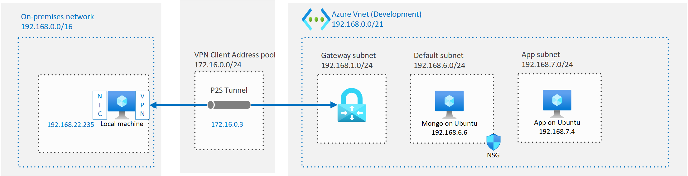

# Spring Retry with Mongo

Example code to show how to impelment spring retry with Mongo.

The code uses Spring Data with Mongo and the ShedLock library


# Dev Setup

Follow instructions setting up VSCode with docker.

Debian GNU/Linux 10

Check version of JDK and maven with ```mvn -v```

Create MongoDB on Ubuntu 18.04 VM

Allow remote connections

Connect to remote mongo "mongodb://<replace_with_server_name_or_ip>:27017" 

Create an `application.properties` file based on `applicaiton.properties.example`.
Replace the mongo host name.

# Time Out Exception

Recreate `Java.net.SocketTimeoutException: connect timed out` by setting vnet rule to deny mongo traffic

This exception is called:  `com.mongodb.MongoSocketOpenException`

# Enable Disable network port on VM

```bash

# lookup process and port
sudo netstat -lnp

sudo ufw allow 27017

sudo ufw deny 27017

```

# Deploy Mongo on Azure VM

Install mongo
Edit config to allow access from remote systems

```bash
sudo vi /etc/mongod.conf

```

Test you can connect to remote
```bash
mongo "mongodb://mongo_server_ip:27017"
```


# Trigger Timeout Issue

- Disconnect from VPN -> Causes `Closed connection` from `com.mongodb.MongoSocketReadException: Prematurely reached end of stream`
- Send packets to black hole

# Point to Site VPN

Configure a point to site vpn connection between the local test machine and the remote mongodb server.



- Development vnet: 192.168.0.0/21
- Default subnet: 192.168.6.0/24
- Gateway subnet: 192.168.1.0/24
- Gateway address pool 172.16.0.0/24

## Black Hole

Create a blackhole route

```bash
sudo ip route add blackhole 10.100.1.10/32
```

# References
- Developing inside a container https://code.visualstudio.com/docs/remote/containers
- https://spring.io/guides/gs/accessing-data-jpa/
- Install Mongo https://docs.mongodb.com/manual/tutorial/install-mongodb-on-ubuntu/
- Spring Retry https://github.com/spring-projects/spring-retry
- Guide to Spring retry https://www.baeldung.com/spring-retry
- Configure P2S VPN https://docs.microsoft.com/en-us/azure/vpn-gateway/vpn-gateway-howto-point-to-site-resource-manager-portal
- https://github.com/lukas-krecan/ShedLock
