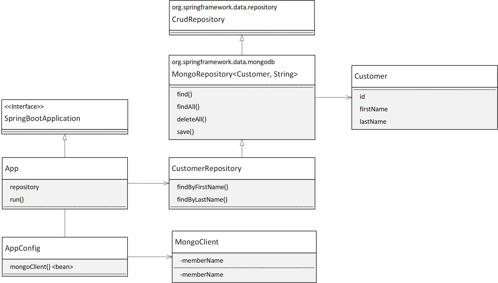

# Spring Retry with Mongo

Example code to show how to impelment spring retry with Mongo.

The code uses Spring Data with Mongo and the ShedLock library


# Dev Setup

Overall steps to configure

- Create Network Environment
- Deploy MongoDB Server
- Deploy App Server
- Configure Local Development Environment

## Create Network Environment

The dev environment has a point to site connection between the local development machine and the remote vms (mongo and app server).


- Development vnet: 192.168.0.0/21
- Default subnet: 192.168.6.0/24
- App subnet: 192.168.7.0/24
- Gateway subnet: 192.168.1.0/24
- Gateway address pool 172.16.0.0/24

## Deploy MongoDB Server

Create MongoDB on Ubuntu 18.04 VM in Default Subnet

Install mongo

Edit config to allow access from remote systems

```bash
sudo vi /etc/mongod.conf
```

Test you can connect to remote
```bash
mongo "mongodb://mongo_server_ip:27017"
```

## Deploy App Server

Create a new Ubuntu 18.04 vm in a subnet on the vnet. 

Install java jdk, maven, and mongo client

```bash
sudo apt install default-jdk
sudo apt install maven

wget -qO - https://www.mongodb.org/static/pgp/server-4.4.asc | sudo apt-key add -
echo "deb [ arch=amd64,arm64 ] https://repo.mongodb.org/apt/ubuntu bionic/mongodb-org/4.4 multiverse" | sudo tee /etc/apt/sources.list.d/mongodb-org-4.4.list
sudo apt-get update
sudo apt-get install -y mongodb-org-shell
```

Get latest code and run the app
```bash
git clone https://github.com/briglx/spring_retry.git
cd spring_retry
mvn clean install
```

Edit the `application.properties` file and replace the value for `database.connectionstring`
```bash
cp application.properties.example application.properties
vi application.properties
```

Run the applicaton
```bash
mvn spring-boot:run
```

## Dev Machine Docker setup

Local development uses a docker image to run the code. 

Follow instructions setting up VSCode with docker.

Debian GNU/Linux 10

Check version of JDK and maven with ```mvn -v```

# Testing

The goal is to recreate a `Java.net.SocketTimeoutException: connect timed out` exception from the app to mongo in order to test the spring-retry capability.

Several techniques are used to recreate the error.

This is the class diagram of the application



## NSG Deny Rule to Mongo

Configure an NSG deny rule to mongo.

Outcome: This exception is called:  `com.mongodb.MongoSocketOpenException`

## Disable network port on Mongo Server 

From the Mongo Server, deny traffic to app.

```bash
sudo netstat -lnp
sudo ufw allow 27017
sudo ufw deny 27017
```
Outcome: This doesn't affect already established connections.

## Disconnect from VPN

Close the vpn connection.

Outcome: `Closed connection` from `com.mongodb.MongoSocketReadException: Prematurely reached end of stream`

## Black Hole

From the App server send traffic intended to mongo to the blackhole.

Create a blackhole route:

```bash
sudo ip route add blackhole 192.168.6.6/32
```


# References
- Developing inside a container https://code.visualstudio.com/docs/remote/containers
- https://spring.io/guides/gs/accessing-data-jpa/
- Install Mongo https://docs.mongodb.com/manual/tutorial/install-mongodb-on-ubuntu/
- Spring Retry https://github.com/spring-projects/spring-retry
- Guide to Spring retry https://www.baeldung.com/spring-retry
- Configure P2S VPN https://docs.microsoft.com/en-us/azure/vpn-gateway/vpn-gateway-howto-point-to-site-resource-manager-portal
- Install jdk on ubuntu https://linoxide.com/ubuntu-how-to/install-java-ubuntu-20-04/
- Install mongo client https://docs.mongodb.com/manual/tutorial/install-mongodb-on-ubuntu/
- https://github.com/lukas-krecan/ShedLock
